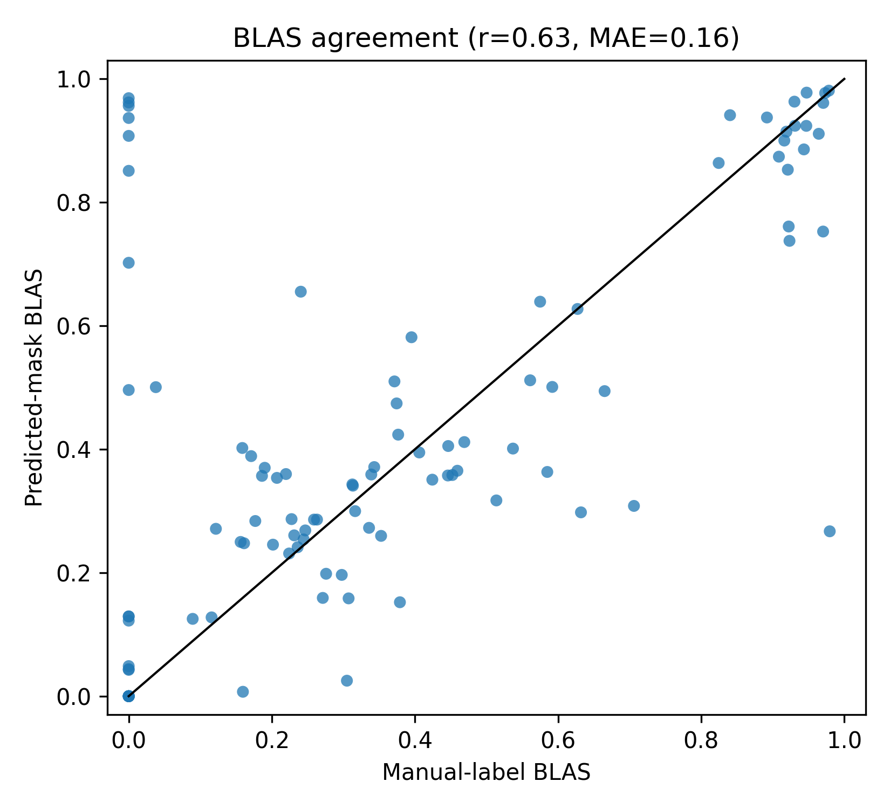
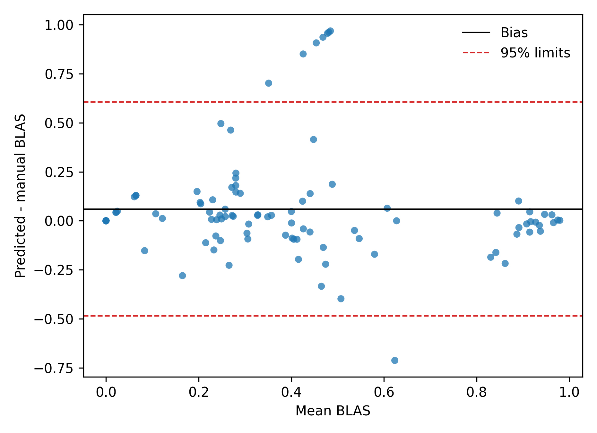
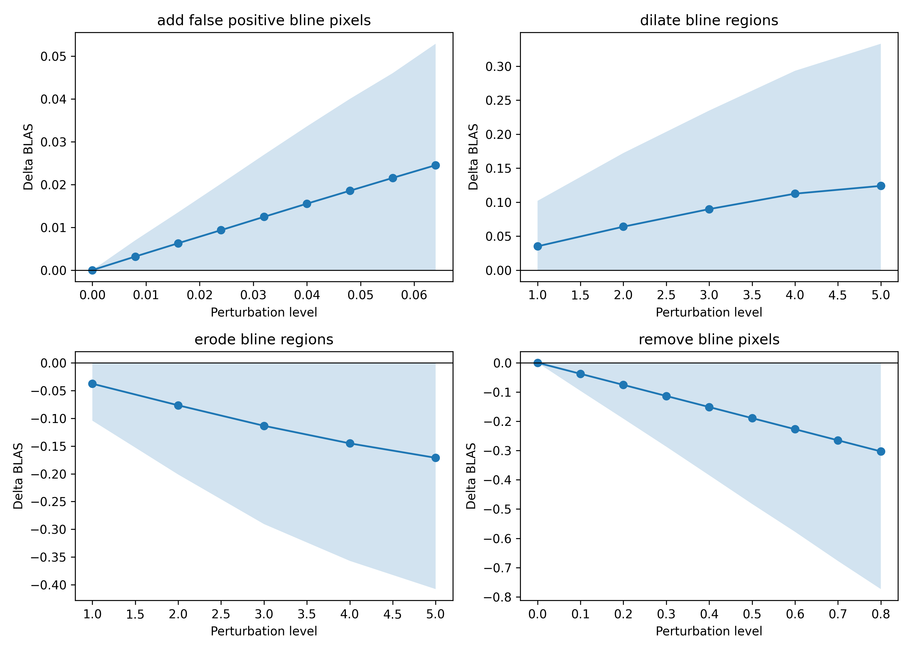
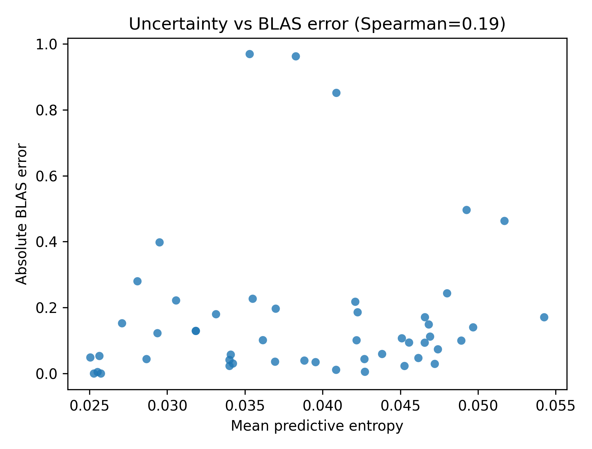
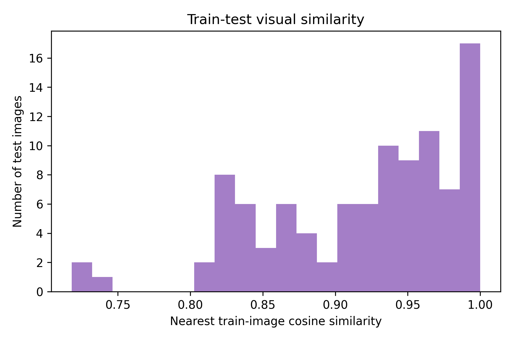
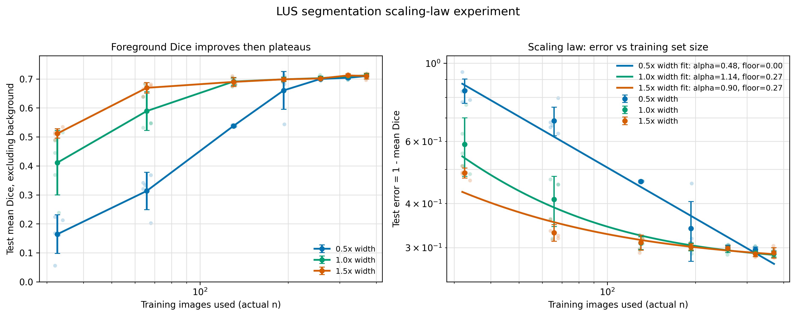

# Engineering Analysis Results

This repository contains the engineering analysis for a reproduced lung ultrasound
(LUS) segmentation model and its downstream B-line Artefact Score (BLAS). The focus is
whether segmentation masks are reliable enough to support BLAS as a portable,
real-time severity metric.

## Core Question

Can a reproduced LUS segmentation model support BLAS reliably, or do class-specific
segmentation errors in B-line and confluence regions change the downstream severity
score in clinically meaningful ways?

## Reproduced Test-Set Segmentation

The analysis used the public phantom-frame split available in the local workspace:

| Split | Images |
| --- | ---: |
| Training | 464 |
| Test | 100 |

The TensorFlow/Keras model (`model_lus.h5`) was evaluated with the reproduction
preprocessing pipeline: crop, resize to 256 x 256, grayscale normalization, and
multiclass argmax masks for labels 0-5.

| Metric | Result |
| --- | ---: |
| Pixel accuracy | 0.958 |
| Mean Dice excluding background | 0.701 |
| Rib Dice | 0.777 |
| Pleural line Dice | 0.791 |
| A-line Dice | 0.660 |
| B-line Dice | 0.633 |
| B-line confluence Dice | 0.645 |

## BLAS Agreement

BLAS was computed from manual masks and predicted masks, then compared on the 100-frame
test set.

| Metric | Result |
| --- | ---: |
| BLAS mean absolute error | 0.158 |
| BLAS RMSE | 0.284 |
| Bias, predicted minus manual | +0.060 |
| Pearson correlation | 0.626 |
| Spearman correlation | 0.595 |
| Severity-category disagreement | 26/100 frames |

The model is useful but not reliable enough for unqualified BLAS severity scoring. A
26% category-disagreement rate means downstream interpretation can change even when
pixel-level segmentation performance looks acceptable.

## Failure Cases

The largest BLAS errors were dominated by false-positive B-line confluence in frames
whose manual BLAS was low or zero.

| Case | Manual BLAS | Predicted BLAS | Error | Category shift |
| --- | ---: | ---: | ---: | --- |
| S316-F39 | 0.000 | 0.969 | +0.969 | low to high |
| S316-F78 | 0.000 | 0.962 | +0.962 | low to high |
| S316-F66 | 0.000 | 0.956 | +0.956 | low to high |
| S01-F12 | 0.000 | 0.937 | +0.937 | low to high |
| S80-F19 | 0.980 | 0.267 | -0.713 | high to low |

Example panels are stored in
`outputs/engineering_analysis/failure_cases/`.

## BLAS Sensitivity

Controlled perturbations showed that BLAS is especially sensitive to the vertical extent
of B-line and confluence masks.

| Perturbation | Result |
| --- | ---: |
| Five iterations of B-line/confluence dilation | mean BLAS change +0.124 |
| Five iterations of B-line/confluence erosion | mean BLAS change -0.171 |
| Removing 50% of B-line/confluence pixels | mean BLAS change -0.189 |
| Adding false-positive B-line pixels at level 0.064 | mean BLAS change +0.025 |

This supports the central engineering conclusion: BLAS is interpretable, but its
reliability depends strongly on robust segmentation of B-line and confluence morphology.

## Conformal Uncertainty

A lightweight conformal/uncertainty analysis used half of the test set for calibration
and half for held-out evaluation.

| Subset | Coverage / correlation result |
| --- | --- |
| All pixels | coverage 0.905; Spearman entropy vs BLAS error 0.195 |
| Foreground pixels | Spearman entropy vs BLAS error 0.017 |
| Manual BLAS ROI | Spearman entropy vs BLAS error 0.218 |
| Manual B-line/confluence pixels | Spearman entropy vs BLAS error -0.027 |

Pixel-level uncertainty did not reliably identify frames with large downstream BLAS
error. The global conformal result is close to the nominal 90% coverage target, but it is
diluted by background pixels and does not solve BLAS-level reliability.

## Portable Deployment Estimate

| Platform assumption | FPS | Energy/frame | Estimated 50 Wh runtime |
| --- | ---: | ---: | ---: |
| Local CPU TensorFlow, 25 W | 6.82 | 3.67 J | 2.0 h |
| Jetson-class 15 W, same latency | 6.82 | 2.20 J | 3.3 h |
| 5 W edge accelerator at 10 FPS | 10.0 | 0.50 J | 10.0 h |
| 3 W portable CPU at 1 FPS | 1.0 | 3.00 J | 16.7 h |

Model size and compute:

| Metric | Result |
| --- | ---: |
| Parameters | 7.86 million |
| Estimated compute | 13.9 GMAC/frame |
| Local TensorFlow inference | 0.147 s/frame |

Portable inference appears technically plausible, but a deployable ultrasound system
would need hardware-specific benchmarking, thermal testing, and integration testing with
the scanner display pipeline.

## Train-Test Similarity

The leakage probe found no shared sequence IDs between train and test splits. However,
the phantom domain remains visually redundant.

| Similarity result | Count |
| --- | ---: |
| Shared train/test sequence IDs | 0 |
| Test images with nearest-train cosine similarity >= 0.99 | 17/100 |
| Test images with nearest-train cosine similarity >= 0.95 | 41/100 |

This does not prove leakage, but it suggests phantom test performance should be framed
as controlled phantom reproducibility rather than evidence of clinical generalization.

## Scaling-Law Experiment

The scaling-law experiment completed all 105 planned runs: 7 training sizes x 3 model
widths x 5 random seeds.

| Training target | 0.5x width Dice | 1.0x width Dice | 1.5x width Dice |
| ---: | ---: | ---: | ---: |
| 32 | 0.164 | 0.411 | 0.512 |
| 64 | 0.313 | 0.589 | 0.669 |
| 128 | 0.538 | 0.691 | 0.690 |
| 192 | 0.660 | 0.699 | 0.699 |
| 256 | 0.700 | 0.703 | 0.702 |
| 320 | 0.704 | 0.710 | 0.712 |
| 370 | 0.710 | 0.712 | 0.710 |

Mean foreground Dice increases with training-set size and then plateaus near 0.71 by
roughly 320-370 training images. Wider models help most in the low-data regime, but by
the largest training sizes 1.0x and 1.5x models converge, suggesting the bottleneck is not
only model capacity.

## Main Conclusion

The reproduced segmentation model is technically useful, but BLAS is more sensitive
than pixel accuracy alone suggests. False-positive confluence and under-detected
B-line/confluence morphology can shift BLAS severity categories. Before BLAS is treated
as a portable decision-support metric, it needs prospective patient-level validation,
scanner/acquisition robustness testing, clinically calibrated thresholds, and
hardware-specific deployment measurements.

## Key Output Files

| Output | Purpose |
| --- | --- |
| `outputs/engineering_analysis/blas_agreement_summary.json` | BLAS agreement metrics |
| `outputs/engineering_analysis/blas_agreement_cases.csv` | Per-frame BLAS target, prediction, and error |
| `outputs/engineering_analysis/failure_cases/` | Top BLAS failure-case panels |
| `outputs/engineering_analysis/sensitivity_summary.csv` | Aggregate perturbation results |
| `outputs/engineering_analysis/conformal_blas_refined_summary.csv` | Localized uncertainty correlations |
| `outputs/engineering_analysis/portable_energy_summary.json` | Model size, compute, and speed |
| `outputs/engineering_analysis/train_test_similarity_summary.json` | Train-test similarity probe |
| `outputs/engineering_analysis/scaling_law_summary_by_size.csv` | Scaling-law summary by size and width |
